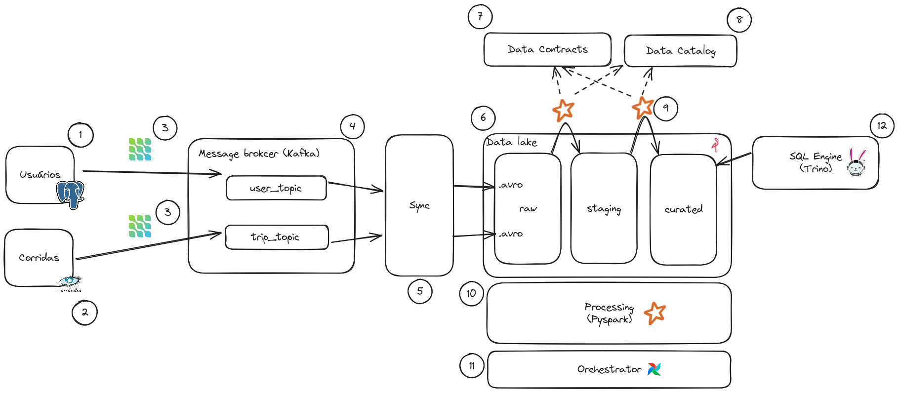

# 3 - Arquitetura da Plataforma de Dados para eventos

## Definições iniciais
Temos que a tabela de usuários (item 1) pertence a um banco relacional. No exemplo em questão utilizamos o mysql. Por outro lado temos que as corridas (item 2) estão sendo armazenadas em um banco colunar visto a sua grande quantidade de escritas.

A seguir iriemos pontuar cada um dos bullets apontados na arquitetura, prós e contras bem como possíveis alternativas que possam ser levadas em consideração na escolha da arquitetura final.

### 1 - [PostgreSQL](https://www.postgresql.org/)
Como a tabela de usuário tende a ter um número de interações relativamente baixo, as interações previstas são de novos cadastros e atualizações de dados cadastrais.

### 2 - [Cassandra](https://cassandra.apache.org)
Devido a grande quantidade de escritas nessa  tabela optou-se por armazená-la num banco de dados colunar tirando proveito da alta capacidade de escrita. 

### 3 - [Debezium](https://debezium.io/)
Com o objetivo de indetificar qualquer alteração nos dados, utilizou-se o debezium como uma solução para a captura das mudanças de dados.

### 4 - [Kafka](https://kafka.apache.org/)
O Kafka possui diversos recursos para que reforçam a garantia de entrega e retenção das mensagens, dessa forma nenhum dado será perdido.

### 5 - Sync
O processo de sync dos dados pode variar dependendo do foco. Nessa arquitetura em questão, tem-se como objeto do sync trazer os dados que estão nos tópicos do kafka para a camada raw do data-lake sem que nenhuma alteração seja realizada nesse processo.

### 6 - [Minio](https://min.io)
O minio implenta a API do S3, entregando assim uma forma fácil para abstrair a implementação do data-lake. Além disso, o mesmo tem a capacidade de utilizar outros object storares abstraindo assim a complexidade de lhe dar com multicloud quando necessário.

### 7 - [DataContracts](https://datacontract.com/)
A ideia por trás dos contratos de dados é garatir que produtos de dados consiram ser robustos e utilizados por diversas áreas da empresa. Assim como as APIs permitem a interoperabilidade das aplicações os contratos de dados têm como objetivo garantir uma interface de comunicação entre produtores e consumidores de dados.

### 8 - [Data Catalog](https://www.unitycatalog.io/)
O catalogo de dados tem como objetivo dar uma visão e organização aos dados aremazenados no data-lake. Assim como um tagalogo de produto nos traz uma visão de como ele sem que tenhamos que abrir o pacote o catalogo de dados permite que saibamos onde está a informação sem que seja necessário explorar as bases.

### 9 - [Data Quality]()
Através da utilização dos contratos de dados e do catálogo é possível exectar processos de teste de qualidade dos dados do lake, garantindo assim que sempre estejam em sua melhor forma.

### 10 - [Pyspark](https://spark.apache.org/docs/latest/api/python/index.html)
A sua natureza distruibidada de processamento bem como a curva de aprendizado relativamente baixa, faz com que pypark seja uma alternativa muito utilizada quando se trata de processamento de dados em larga escala.

### 11 - [Airflow](https://airflow.apache.org/)
Desenvolvida com o objetivo de facilitar o desenvolvimento de pipelines complexas de dados. O Apache airflow conta com diversos operadores que permitem coordenar execuções simples e complexas de forma transparente, permotindo a extração do melhor de cada abordagem. 

### 12 - [Trino](https://trino.io/)
O trino (antigo prestoSQL) permite que realizemos consultas diretamente nas bases de dados do data-lake reduzindo a necessidade d subir clusteres ou notebooks para exploração dos arquivos.