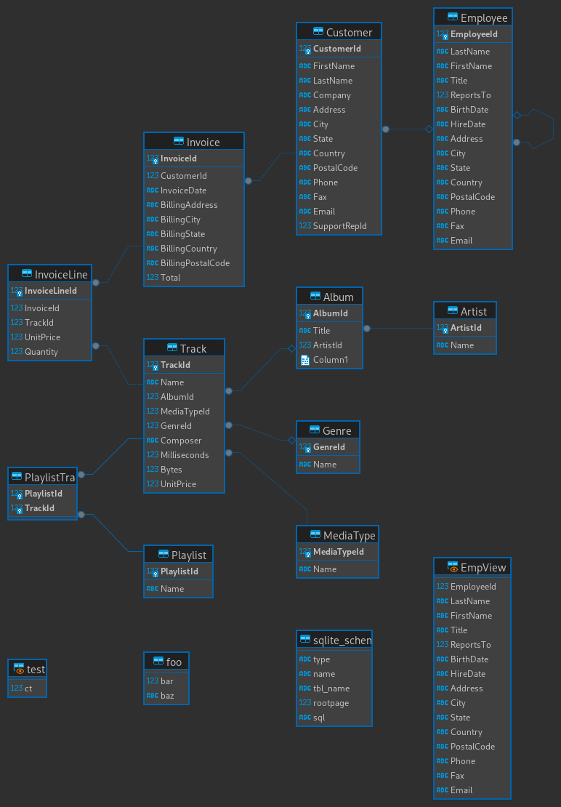

# 1 -  Análises com SQL
### Diagrame ER



### Query
```sql
with itunes_sales as (
  SELECT art.Name as artist,
    gen.Name as genre,
    (inv.UnitPrice * inv.Quantity) as sales
  FROM Track t
    JOIN InvoiceLine inv on t.TrackId = inv.TrackId
    JOIN Album alb on alb.AlbumId = t.AlbumId
    JOIN Artist art on alb.ArtistId = art.ArtistId
    JOIN Genre gen on t.GenreId = gen.GenreId
),
percent_sales as (
  select DISTINCT artist,
    genre,
    sum(sales) OVER (artist_genre_window) as sales,
    sum(sales) OVER (artist_genre_window) / sum(sales) OVER (genre_window) as sales_percentage_by_genre
  from itunes_sales WINDOW genre_window as (PARTITION BY genre),
    artist_genre_window as (PARTITION BY artist, genre)
  order by genre ASC,
    sales_percentage_by_genre DESC
)
SELECT DISTINCT artist,
  genre,
  round(sales, 2),
  round(100 * sales_percentage_by_genre, 1) as sales_percentage_by_genre,
  round(
    100 * SUM(sales_percentage_by_genre) OVER(
      PARTITION BY genre
      ORDER BY genre ROWS BETWEEN UNBOUNDED PRECEDING AND CURRENT ROW
    ),
    1
  ) AS cumulative_sum_by_genre
FROM percent_sales
```

### Resultado
| artist                                                  |genre             |sales|sales_percentage_by_genre|cumulative_sum_by_genre|
|---------------------------------------------------------------------------------------|--------------------|-------|-------|-------|
| Audioslave                                                                            | Alternative        | 4.95  | 35.7  | 35.7  |
| Chris Cornell                                                                         | Alternative        | 3.96  | 28.6  | 64.3  |
| Temple of the Dog                                                                     | Alternative        | 3.96  | 28.6  | 92.9  |
| Calexico                                                                              | Alternative        | 0.99  | 7.1   | 100.0 |
| Titãs                                                                                 | Alternative & Punk | 33.66 | 13.9  | 13.9  |
| Faith No More                                                                         | Alternative & Punk | 32.67 | 13.5  | 27.5  |
| Green Day                                                                             | Alternative & Punk | 32.67 | 13.5  | 41.0  |
| R.E.M.                                                                                | Alternative & Punk | 24.75 | 10.2  | 51.2  |
| Smashing Pumpkins                                                                     | Alternative & Punk | 23.76 | 9.8   | 61.1  |
| The Tea Party                                                                         | Alternative & Punk | 16.83 | 7.0   | 68.0  |
| Body Count                                                                            | Alternative & Punk | 10.89 | 4.5   | 72.5  |
| Red Hot Chili Peppers                                                                 | Alternative & Punk | 9.9   | 4.1   | 76.6  |
| The Clash                                                                             | Alternative & Punk | 9.9   | 4.1   | 80.7  |
| R.E.M. Feat. Kate Pearson                                                             | Alternative & Punk | 8.91  | 3.7   | 84.4  |
| Os Mutantes                                                                           | Alternative & Punk | 7.92  | 3.3   | 87.7  |
| JET                                                                                   | Alternative & Punk | 6.93  | 2.9   | 90.6  |
| Raimundos                                                                             | Alternative & Punk | 6.93  | 2.9   | 93.4  |
| Pearl Jam                                                                             | Alternative & Punk | 5.94  | 2.5   | 95.9  |
| Audioslave                                                                            | Alternative & Punk | 4.95  | 2.0   | 98.0  |
| Foo Fighters                                                                          | Alternative & Punk | 4.95  | 2.0   | 100.0 |
| Eric Clapton                                                                          | Blues              | 26.73 | 44.3  | 44.3  |
| The Black Crowes                                                                      | Blues              | 13.86 | 23.0  | 67.2  |
| Stevie Ray Vaughan & Double Trouble                                                   | Blues              | 8.91  | 14.8  | 82.0  |
| Buddy Guy                                                                             | Blues              | 6.93  | 11.5  | 93.4  |
| Iron Maiden                                                                           | Blues              | 3.96  | 6.6   | 100.0 |
| Toquinho & Vinícius                                                                   | Bossa Nova         | 14.85 | 100.0 | 100.0 |
| Michael Tilson Thomas & San Francisco Symphony                                        | Classical          | 2.97  | 7.3   | 7.3   |
| Academy of St. Martin in the Fields, Sir Neville Marriner & Thurston Dart             | Classical          | 1.98  | 4.9   | 12.2  |
| Berliner Philharmoniker & Herbert Von Karajan                                         | Classical          | 1.98  | 4.9   | 17.1  |
| Chicago Symphony Orchestra & Fritz Reiner                                             | Classical          | 1.98  | 4.9   | 22.0  |
| Emerson String Quartet                                                                | Classical          | 1.98  | 4.9   | 26.8  |
| Equale Brass Ensemble, John Eliot Gardiner & Munich Monteverdi Orchestra and Choir    | Classical          | 1.98  | 4.9   | 31.7  |
| Eugene Ormandy                                                                        | Classical          | 1.98  | 4.9   | 36.6  |
| Academy of St. Martin in the Fields & Sir Neville Marriner                            | Classical          | 0.99  | 2.4   | 39.0  |
| Academy of St. Martin in the Fields, John Birch, Sir Neville Marriner & Sylvia McNair | Classical          | 0.99  | 2.4   | 41.5  |
| Adrian Leaper & Doreen de Feis                                                        | Classical          | 0.99  | 2.4   | 43.9  |
| Antal Doráti & London Symphony Orchestra                                              | Classical          | 0.99  | 2.4   | 46.3  |
| Berliner Philharmoniker & Hans Rosbaud                                                | Classical          | 0.99  | 2.4   | 48.8  |
| Edo de Waart & San Francisco Symphony                                                 | Classical          | 0.99  | 2.4   | 51.2  |
| Emanuel Ax, Eugene Ormandy & Philadelphia Orchestra                                   | Classical          | 0.99  | 2.4   | 53.7  |
| English Concert & Trevor Pinnock                                                      | Classical          | 0.99  | 2.4   | 56.1  |
| Felix Schmidt, London Symphony Orchestra & Rafael Frühbeck de Burgos                  | Classical          | 0.99  | 2.4   | 58.5  |
| Göteborgs Symfoniker & Neeme Järvi                                                    | Classical          | 0.99  | 2.4   | 61.0  |
| Julian Bream                                                                          | Classical          | 0.99  | 2.4   | 63.4  |
| Kent Nagano and Orchestre de l'Opéra de Lyon                                          | Classical          | 0.99  | 2.4   | 65.9  |
| Martin Roscoe                                                                         | Classical          | 0.99  | 2.4   | 68.3  |
| Maurizio Pollini                                                                      | Classical          | 0.99  | 2.4   | 70.7  |
| Michele Campanella                                                                    | Classical          | 0.99  | 2.4   | 73.2  |
| Orchestra of The Age of Enlightenment                                                 | Classical          | 0.99  | 2.4   | 75.6  |
| Otto Klemperer & Philharmonia Orchestra                                               | Classical          | 0.99  | 2.4   | 78.0  |
| Philharmonia Orchestra & Sir Neville Marriner                                         | Classical          | 0.99  | 2.4   | 80.5  |
| Roger Norrington, London Classical Players                                            | Classical          | 0.99  | 2.4   | 82.9  |
| Royal Philharmonic Orchestra & Sir Thomas Beecham                                     | Classical          | 0.99  | 2.4   | 85.4  |
| Scholars Baroque Ensemble                                                             | Classical          | 0.99  | 2.4   | 87.8  |
| Sir Georg Solti & Wiener Philharmoniker                                               | Classical          | 0.99  | 2.4   | 90.2  |
| The 12 Cellists of The Berlin Philharmonic                                            | Classical          | 0.99  | 2.4   | 92.7  |
| The King's Singers                                                                    | Classical          | 0.99  | 2.4   | 95.1  |
| Yehudi Menuhin                                                                        | Classical          | 0.99  | 2.4   | 97.6  |
| Yo-Yo Ma                                                                              | Classical          | 0.99  | 2.4   | 100.0 |
| The Office                                                                            | Comedy             | 17.91 | 100.0 | 100.0 |
| Lost                                                                                  | Drama              | 35.82 | 62.1  | 62.1  |
| Heroes                                                                                | Drama              | 21.89 | 37.9  | 100.0 |
| Frank Sinatra                                                                         | Easy Listening     | 9.9   | 100.0 | 100.0 |
| O Rappa                                                                               | Electronica/Dance  | 6.93  | 58.3  | 58.3  |
| Jamiroquai                                                                            | Electronica/Dance  | 4.95  | 41.7  | 100.0 |
| Iron Maiden                                                                           | Heavy Metal        | 11.88 | 100.0 | 100.0 |
| Planet Hemp                                                                           | Hip Hop/Rap        | 8.91  | 52.9  | 52.9  |
| House Of Pain                                                                         | Hip Hop/Rap        | 7.92  | 47.1  | 100.0 |
| Spyro Gyra                                                                            | Jazz               | 19.8  | 25.0  | 25.0  |
| Gene Krupa                                                                            | Jazz               | 16.83 | 21.2  | 46.3  |
| Miles Davis                                                                           | Jazz               | 16.83 | 21.2  | 67.5  |
| Incognito                                                                             | Jazz               | 8.91  | 11.3  | 78.8  |
| Antônio Carlos Jobim                                                                  | Jazz               | 6.93  | 8.8   | 87.5  |
| Billy Cobham                                                                          | Jazz               | 3.96  | 5.0   | 92.5  |
| Dennis Chambers                                                                       | Jazz               | 3.96  | 5.0   | 97.5  |
| Gilberto Gil                                                                          | Jazz               | 1.98  | 2.5   | 100.0 |
| Os Paralamas Do Sucesso                                                               | Latin              | 44.55 | 11.7  | 11.7  |
| Chico Buarque                                                                         | Latin              | 26.73 | 7.0   | 18.7  |
| Chico Science & Nação Zumbi                                                           | Latin              | 24.75 | 6.5   | 25.1  |
| Tim Maia                                                                              | Latin              | 23.76 | 6.2   | 31.3  |
| Caetano Veloso                                                                        | Latin              | 20.79 | 5.4   | 36.8  |
| Cássia Eller                                                                          | Latin              | 20.79 | 5.4   | 42.2  |
| Djavan                                                                                | Latin              | 17.82 | 4.7   | 46.9  |
| Legião Urbana                                                                         | Latin              | 16.83 | 4.4   | 51.3  |
| Various Artists                                                                       | Latin              | 16.83 | 4.4   | 55.7  |
| Antônio Carlos Jobim                                                                  | Latin              | 14.85 | 3.9   | 59.6  |
| Milton Nascimento                                                                     | Latin              | 14.85 | 3.9   | 63.5  |
| Elis Regina                                                                           | Latin              | 12.87 | 3.4   | 66.8  |
| Eric Clapton                                                                          | Latin              | 12.87 | 3.4   | 70.2  |
| Gilberto Gil                                                                          | Latin              | 12.87 | 3.4   | 73.6  |
| Lulu Santos                                                                           | Latin              | 12.87 | 3.4   | 76.9  |
| Olodum                                                                                | Latin              | 9.9   | 2.6   | 79.5  |
| Gonzaguinha                                                                           | Latin              | 8.91  | 2.3   | 81.9  |
| Zeca Pagodinho                                                                        | Latin              | 8.91  | 2.3   | 84.2  |
| Falamansa                                                                             | Latin              | 7.92  | 2.1   | 86.3  |
| Funk Como Le Gusta                                                                    | Latin              | 7.92  | 2.1   | 88.3  |
| Marisa Monte                                                                          | Latin              | 7.92  | 2.1   | 90.4  |
| Marcos Valle                                                                          | Latin              | 6.93  | 1.8   | 92.2  |
| Ed Motta                                                                              | Latin              | 5.94  | 1.6   | 93.8  |
| Jorge Ben                                                                             | Latin              | 5.94  | 1.6   | 95.3  |
| Jota Quest                                                                            | Latin              | 5.94  | 1.6   | 96.9  |
| Vinícius De Moraes                                                                    | Latin              | 5.94  | 1.6   | 98.4  |
| Cláudio Zoli                                                                          | Latin              | 4.95  | 1.3   | 99.7  |
| Luciana Souza/Romero Lubambo                                                          | Latin              | 0.99  | 0.3   | 100.0 |
| Metallica                                                                             | Metal              | 90.09 | 34.5  | 34.5  |
| Iron Maiden                                                                           | Metal              | 69.3  | 26.5  | 61.0  |
| Bruce Dickinson                                                                       | Metal              | 11.88 | 4.5   | 65.5  |
| System Of A Down                                                                      | Metal              | 11.88 | 4.5   | 70.1  |
| Guns N' Roses                                                                         | Metal              | 9.9   | 3.8   | 73.9  |
| Judas Priest                                                                          | Metal              | 9.9   | 3.8   | 77.7  |
| Ozzy Osbourne                                                                         | Metal              | 9.9   | 3.8   | 81.4  |
| Black Sabbath                                                                         | Metal              | 8.91  | 3.4   | 84.8  |
| Black Label Society                                                                   | Metal              | 7.92  | 3.0   | 87.9  |
| Godsmack                                                                              | Metal              | 7.92  | 3.0   | 90.9  |
| Lenny Kravitz                                                                         | Metal              | 6.93  | 2.7   | 93.6  |
| Mötley Crüe                                                                           | Metal              | 6.93  | 2.7   | 96.2  |
| Motörhead                                                                             | Metal              | 5.94  | 2.3   | 98.5  |
| Apocalyptica                                                                          | Metal              | 3.96  | 1.5   | 100.0 |
| U2                                                                                    | Pop                | 15.84 | 57.1  | 57.1  |
| Amy Winehouse                                                                         | Pop                | 5.94  | 21.4  | 78.6  |
| Various Artists                                                                       | Pop                | 5.94  | 21.4  | 100.0 |
| Amy Winehouse                                                                         | R&B/Soul           | 11.88 | 29.3  | 29.3  |
| James Brown                                                                           | R&B/Soul           | 11.88 | 29.3  | 58.5  |
| Marvin Gaye                                                                           | R&B/Soul           | 9.9   | 24.4  | 82.9  |
| Jamiroquai                                                                            | R&B/Soul           | 6.93  | 17.1  | 100.0 |
| Cidade Negra                                                                          | Reggae             | 15.84 | 53.3  | 53.3  |
| UB40                                                                                  | Reggae             | 7.92  | 26.7  | 80.0  |
| Lenny Kravitz                                                                         | Reggae             | 5.94  | 20.0  | 100.0 |
| U2                                                                                    | Rock               | 90.09 | 10.9  | 10.9  |
| Led Zeppelin                                                                          | Rock               | 86.13 | 10.4  | 21.3  |
| Iron Maiden                                                                           | Rock               | 53.46 | 6.5   | 27.8  |
| Deep Purple                                                                           | Rock               | 43.56 | 5.3   | 33.1  |
| Creedence Clearwater Revival                                                          | Rock               | 36.63 | 4.4   | 37.5  |
| Queen                                                                                 | Rock               | 36.63 | 4.4   | 41.9  |
| Kiss                                                                                  | Rock               | 30.69 | 3.7   | 45.6  |
| Van Halen                                                                             | Rock               | 28.71 | 3.5   | 49.1  |
| Guns N' Roses                                                                         | Rock               | 25.74 | 3.1   | 52.2  |
| Pearl Jam                                                                             | Rock               | 25.74 | 3.1   | 55.3  |
| The Who                                                                               | Rock               | 18.81 | 2.3   | 57.6  |
| The Rolling Stones                                                                    | Rock               | 17.82 | 2.2   | 59.8  |
| Foo Fighters                                                                          | Rock               | 16.83 | 2.0   | 61.8  |
| Red Hot Chili Peppers                                                                 | Rock               | 16.83 | 2.0   | 63.8  |
| AC/DC                                                                                 | Rock               | 15.84 | 1.9   | 65.7  |
| The Cult                                                                              | Rock               | 15.84 | 1.9   | 67.7  |
| Soundgarden                                                                           | Rock               | 14.85 | 1.8   | 69.5  |
| Ozzy Osbourne                                                                         | Rock               | 13.86 | 1.7   | 71.1  |
| R.E.M.                                                                                | Rock               | 13.86 | 1.7   | 72.8  |
| Lenny Kravitz                                                                         | Rock               | 12.87 | 1.6   | 74.4  |
| O Terço                                                                               | Rock               | 12.87 | 1.6   | 75.9  |
| Nirvana                                                                               | Rock               | 11.88 | 1.4   | 77.4  |
| Santana                                                                               | Rock               | 11.88 | 1.4   | 78.8  |
| Aerosmith                                                                             | Rock               | 9.9   | 1.2   | 80.0  |
| Raul Seixas                                                                           | Rock               | 9.9   | 1.2   | 81.2  |
| Skank                                                                                 | Rock               | 9.9   | 1.2   | 82.4  |
| Stone Temple Pilots                                                                   | Rock               | 9.9   | 1.2   | 83.6  |
| Faith No More                                                                         | Rock               | 8.91  | 1.1   | 84.7  |
| Alanis Morissette                                                                     | Rock               | 7.92  | 1.0   | 85.6  |
| David Coverdale                                                                       | Rock               | 7.92  | 1.0   | 86.6  |
| Jimi Hendrix                                                                          | Rock               | 7.92  | 1.0   | 87.5  |
| Men At Work                                                                           | Rock               | 7.92  | 1.0   | 88.5  |
| Page & Plant                                                                          | Rock               | 7.92  | 1.0   | 89.5  |
| Alice In Chains                                                                       | Rock               | 6.93  | 0.8   | 90.3  |
| Def Leppard                                                                           | Rock               | 6.93  | 0.8   | 91.1  |
| The Police                                                                            | Rock               | 6.93  | 0.8   | 92.0  |
| Audioslave                                                                            | Rock               | 5.94  | 0.7   | 92.7  |
| Jamiroquai                                                                            | Rock               | 5.94  | 0.7   | 93.4  |
| Rush                                                                                  | Rock               | 5.94  | 0.7   | 94.1  |
| Velvet Revolver                                                                       | Rock               | 5.94  | 0.7   | 94.9  |
| Accept                                                                                | Rock               | 4.95  | 0.6   | 95.4  |
| Marillion                                                                             | Rock               | 4.95  | 0.6   | 96.0  |
| Paul D'Ianno                                                                          | Rock               | 4.95  | 0.6   | 96.6  |
| Scorpions                                                                             | Rock               | 4.95  | 0.6   | 97.2  |
| Terry Bozzio, Tony Levin & Steve Stevens                                              | Rock               | 4.95  | 0.6   | 97.8  |
| Frank Zappa & Captain Beefheart                                                       | Rock               | 3.96  | 0.5   | 98.3  |
| Joe Satriani                                                                          | Rock               | 3.96  | 0.5   | 98.8  |
| Pink Floyd                                                                            | Rock               | 3.96  | 0.5   | 99.3  |
| The Doors                                                                             | Rock               | 3.96  | 0.5   | 99.8  |
| Dread Zeppelin                                                                        | Rock               | 0.99  | 0.1   | 99.9  |
| The Posies                                                                            | Rock               | 0.99  | 0.1   | 100.0 |
| BackBeat                                                                              | Rock And Roll      | 5.94  | 100.0 | 100.0 |
| Battlestar Galactica (Classic)                                                        | Sci Fi & Fantasy   | 35.82 | 90.0  | 90.0  |
| Battlestar Galactica                                                                  | Sci Fi & Fantasy   | 3.98  | 10.0  | 100.0 |
| Battlestar Galactica                                                                  | Science Fiction    | 11.94 | 100.0 | 100.0 |
| Passengers                                                                            | Soundtrack         | 8.91  | 45.0  | 45.0  |
| Various Artists                                                                       | Soundtrack         | 5.94  | 30.0  | 75.0  |
| Gilberto Gil                                                                          | Soundtrack         | 4.95  | 25.0  | 100.0 |
| Lost                                                                                  | TV Shows           | 45.77 | 48.9  | 48.9  |
| The Office                                                                            | TV Shows           | 31.84 | 34.0  | 83.0  |
| Battlestar Galactica                                                                  | TV Shows           | 7.96  | 8.5   | 91.5  |
| Aquaman                                                                               | TV Shows           | 3.98  | 4.3   | 95.7  |
| Heroes                                                                                | TV Shows           | 3.98  | 4.3   | 100.0 |
| João Suplicy                                                                          | World              | 5.94  | 46.2  | 46.2  |
| Mônica Marianno                                                                       | World              | 5.94  | 46.2  | 92.3  |
| Habib Koité and Bamada                                                                | World              | 0.99  | 7.7   | 100.0 |